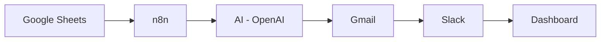

# AR Copilot — AI Accounts Receivable Automation


A prototype that automates the accounts receivable follow-up loop end to end: it reads an
invoice ledger, figures out who's overdue and how urgent it is, writes a personalized
reminder with AI, sends it, updates the record, pages the finance team for high-risk
accounts, and rolls everything into a live dashboard.

## Demo

- **Video walkthrough:** _[add your Loom link here]_
- **Live dashboard preview:** open [`dashboard/index.html`](dashboard/index.html) directly in a browser — no server required

## Purpose
AR Copilot automates entire finance loop. 

## Features

- **Reads live invoice data** 
- **Calculates days overdue**
- **Assigns a risk tier** — 
- **Generates a personalized reminder email per invoice** 
- **Sends the email via Gmail** 
- **Rolls everything into a finance dashboard**: Total Outstanding, Total Paid, Overdue
  Invoices, High Risk Accounts, Average Days Late, Total AR Balance

## Architecture



Full diagram with every node and the reasoning behind the design is in
[`docs/architecture.md`](docs/architecture.md).

## Tech stack

| Layer | Tool |
|---|---|
| Orchestration | [n8n](https://n8n.io) |
| Data store | Google Sheets |
| AI generation | OpenAI API 
| Email delivery | Gmail |
| Reporting | Static Dashboard |

## Project structure

```
ar-copilot/
├── README.md
├── LICENSE
├── n8n/
│   └── AR-Copilot-Workflow.json  #full detailed workflow
├── prompts/
│   └── reminder-email-prompt.md  
├── templates/
│   └── email-templates.md      
├── dashboard/
│   └── index.html              
```

## Risk logic

| Days Late | Risk Tier | Trigger |
|---|---|---|
| 1–5 | Low | 1st reminder, friendly tone |
| 6–15 | Medium | 2nd reminder, firmer tone |
| 16–29 | High | 2nd reminder |
| 30+ | Escalate | Final notice|


## License

MIT — see [`LICENSE`](LICENSE).
