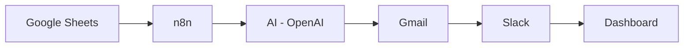

# AR Copilot — AI Accounts Receivable Automation


A prototype that automates the accounts receivable follow-up loop end to end: it reads an
invoice ledger, figures out who's overdue and how urgent it is, writes a personalized
reminder with AI, sends it, updates the record, pages the finance team for high-risk
accounts, and rolls everything into a live dashboard.

Built as a take-home project. Inspired by (not copied from) [AbdulRehman448/n8n-invoice-payment-automation](https://github.com/AbdulRehman448/n8n-invoice-payment-automation)
— see [`docs/comparison.md`](docs/comparison.md) for exactly what's different and why.

## Demo

- **Video walkthrough:** _[add your Loom link here]_
- **Live dashboard preview:** open [`dashboard/index.html`](dashboard/index.html) directly in a browser — no server required

## Purpose

Manually chasing overdue invoices doesn't scale: someone has to check due dates, judge how
urgent each one is, write a reminder that matches that urgency, send it, log it, and flag
the risky accounts to the right person. AR Copilot automates that entire loop while keeping
the risky decision (how urgent is this account?) in deterministic, auditable code and using
AI only where it adds real value — writing natural, contextual reminder copy.

## Features

- **Reads live invoice data** from a Google Sheet acting as the system of record
- **Calculates days overdue** for every unpaid invoice on a daily schedule
- **Assigns a risk tier** — Low / Medium / High / Escalate — from a simple, transparent rule
- **Generates a personalized reminder email per invoice** with OpenAI, where tone escalates
  with risk tier (see [`prompts/reminder-email-prompt.md`](prompts/reminder-email-prompt.md))
- **Sends the email via Gmail** and writes the result back to the sheet
- **Alerts the finance team on Slack** for High/Escalate accounts only — no alert fatigue
- **Rolls everything into a finance dashboard**: Total Outstanding, Total Paid, Overdue
  Invoices, High Risk Accounts, Average Days Late, Total AR Balance

## Architecture



Full diagram with every node and the reasoning behind the design is in
[`docs/architecture.md`](docs/architecture.md).

## Tech stack

| Layer | Tool |
|---|---|
| Orchestration | [n8n](https://n8n.io) |
| Data store | Google Sheets |
| AI generation | OpenAI API (swappable for OpenRouter or Gemini — see prompt doc) |
| Email delivery | Gmail |
| Team alerts | Slack |
| Reporting | Static HTML dashboard (Chart.js) |

## Project structure

```
ar-copilot/
├── README.md
├── LICENSE
├── data/
│   └── invoices.csv              # 32 seeded invoices, all risk tiers represented
├── n8n/
│   └── AR-Copilot-Workflow.json  # importable end-to-end workflow
├── prompts/
│   └── reminder-email-prompt.md  # AI prompt spec + design rationale
├── templates/
│   └── email-templates.md        # reference: First / Second / Final Notice tones
├── dashboard/
│   └── index.html                # standalone finance dashboard, no build step
└── docs/
    ├── architecture.md           # Mermaid diagram + component responsibilities
    ├── risk-logic.md             # risk tier rules + why they're code, not AI
    ├── setup-guide.md            # step-by-step: clone → record the demo video
    ├── screenshots-checklist.md  # exactly what to capture, in order
    ├── loom-script.md            # 2-minute demo script
    ├── comparison.md             # vs. the original repo, and what's different
    ├── github-polish.md          # checklist for making the public repo look sharp
    └── screenshots/              # drop captured screenshots here
```

## Risk logic

| Days Late | Risk Tier | Trigger |
|---|---|---|
| 1–5 | Low | 1st reminder, friendly tone |
| 6–15 | Medium | 2nd reminder, firmer tone |
| 16–29 | High | 2nd reminder + Slack alert |
| 30+ | Escalate | Final notice + Slack alert |

Details and rationale: [`docs/risk-logic.md`](docs/risk-logic.md).

## Setup & running locally

Full walkthrough, from cloning this repo to recording the demo video, is in
[`docs/setup-guide.md`](docs/setup-guide.md). Short version:

1. Import [`data/invoices.csv`](data/invoices.csv) into a Google Sheet (`Invoices` tab) and
   add an empty `Dashboard` tab.
2. Import [`n8n/AR-Copilot-Workflow.json`](n8n/AR-Copilot-Workflow.json) into n8n.
3. Point the Google Sheets nodes at your Sheet ID, and connect Google Sheets, OpenAI, Gmail,
   and Slack credentials.
4. Run the workflow manually once to verify, then activate the daily schedule.
5. Open [`dashboard/index.html`](dashboard/index.html) in a browser to see the rollup.

## Screenshots

_Add screenshots to `docs/screenshots/` following [`docs/screenshots-checklist.md`](docs/screenshots-checklist.md), then link them here, e.g.:_

```md


```

## Why this design (engineering notes)

- **Risk scoring is deterministic code; email wording is AI.** A finance workflow shouldn't
  let an LLM decide whether an account is "high risk" — that needs to be the same answer
  every time, and auditable. The AI's job is narrower: turn a risk tier and invoice facts
  into natural-sounding copy. See [`docs/risk-logic.md`](docs/risk-logic.md).
- **Escalation is decoupled from the customer email.** The Slack alert to the finance team
  and the reminder email to the customer are two separate outputs of the same risk score —
  one doesn't block or depend on the other.
- **The dashboard branch runs independently of the reminder branch**, off a single Sheets
  read, so KPIs reflect the whole ledger (including paid and not-yet-due invoices), not just
  the invoices that got a reminder that day.

See [`docs/comparison.md`](docs/comparison.md) for how these choices compare to the original
inspiration repo.

## Publishing this repo

If you're pushing this to your own GitHub, see [`docs/github-polish.md`](docs/github-polish.md)
for a quick checklist: repo description, topics, badges, commit structure, and tagging a
release.

## License

MIT — see [`LICENSE`](LICENSE).
