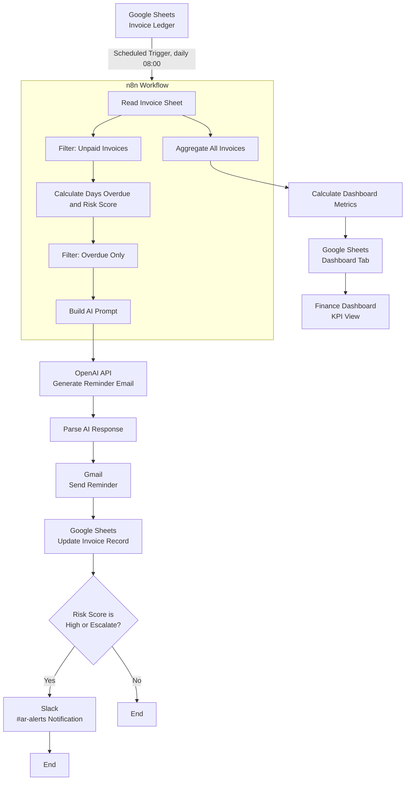

# Architecture

## Flow diagram

## Component responsibilities

| Layer | Tool | Responsibility |
|---|---|---|
| System of record | Google Sheets | Single source of truth for invoice data; also doubles as the "database" for this prototype |
| Orchestration | n8n | Scheduling, branching, retries, connecting every other tool together |
| Decisioning | n8n Code nodes | Deterministic risk scoring and reminder-stage logic (see [`risk-logic.md`](risk-logic.md)) |
| Generation | OpenAI API | Turns risk tier + invoice facts into natural, on-tone email copy (see [`reminder-email-prompt.md`](../prompts/reminder-email-prompt.md)) |
| Delivery | Gmail | Sends the reminder to the customer |
| Persistence | Google Sheets | Writes back `Reminder Sent`, `Days Late`, `Risk Score` so the sheet always reflects the latest run |
| Escalation | Slack | Pages the finance team only for High/Escalate risk — avoids alert fatigue |
| Reporting | Google Sheets + static dashboard | Rolls up the whole ledger into six KPIs every run |

## Why two branches off "Read Invoice Sheet"

The workflow reads the sheet once per run and fans out into two independent branches:

1. **Reminder branch** — filters to unpaid invoices, scores risk, and emails only the ones
   that are actually overdue.
2. **Dashboard branch** — aggregates the *entire* sheet (paid, pending, and overdue) so the
   KPIs reflect the whole portfolio, not just the invoices that got a reminder that day.

Running these in parallel off a single Sheets read avoids a second API call and keeps both
outputs consistent with the same snapshot of data.

## Failure handling (kept intentionally simple)

This is a one-day prototype, not a production system, so error handling is deliberately
minimal but not absent:

- `Parse AI Response` has a try/catch fallback that builds a generic subject/body if the AI
  response isn't valid JSON, so a single bad model response doesn't break the run.
- The Google Sheets **update** step matches on `Invoice ID`, so re-running the workflow is
  idempotent — it won't create duplicate rows.
- n8n's built-in per-node retry (configurable in node settings) is sufficient for transient
  Gmail/Slack/OpenAI API errors; a fuller system would add dead-letter logging, which is
  called out as a "next step" in [`comparison.md`](comparison.md) rather than built here.
